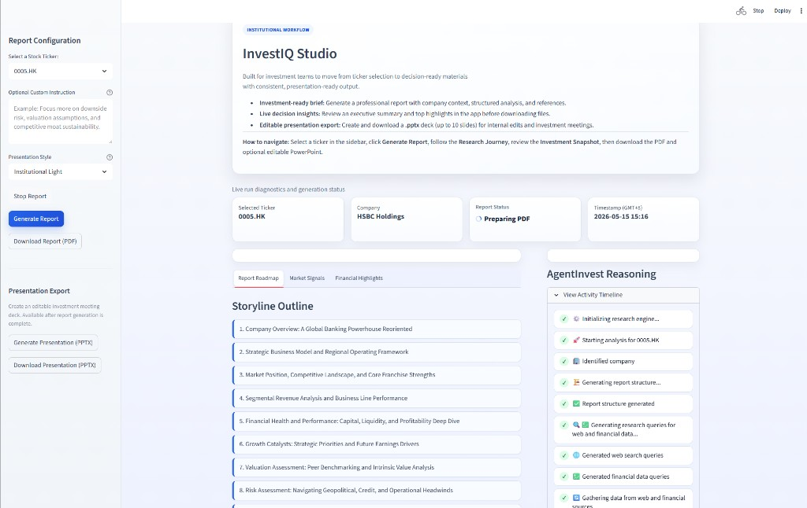
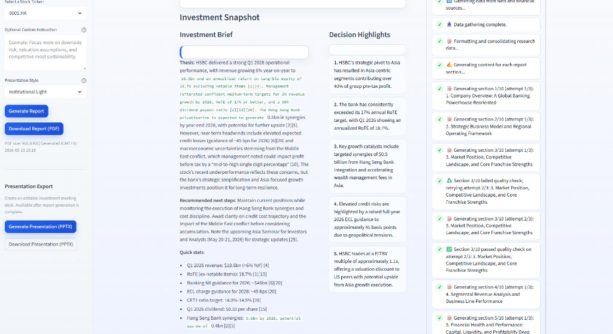
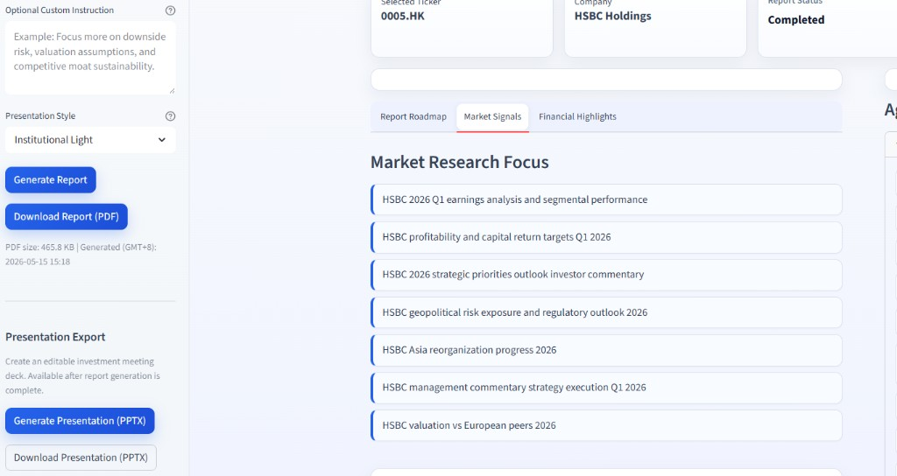
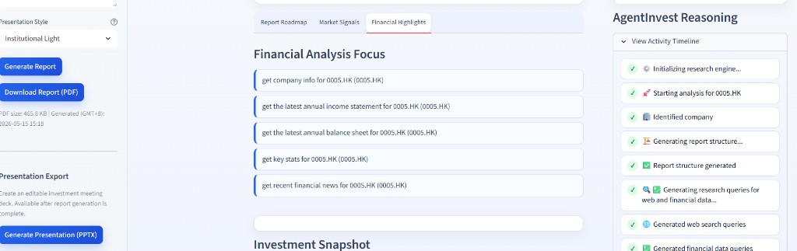

# InvestIQ (Intelligent investment report generation)

[](https://www.python.org/downloads/)
[](https://opensource.org/licenses/MIT)

**InvestIQ** is an AI-powered platform that generates professional investment theses, PDF reports and PowerPoint presentations from a single input: a stock ticker.

## 🚀 Key Features

- **One-click research** from ticker → full investment report
- **Multi-source data** via web search (Tavily) + financials (yfinance)
- **LLM orchestration** through OpenRouter (Gemini, GPT, Claude, etc.)
- **Publication-ready output** with charts, tables, and citations
- **Streamlit UI** for interactive use; CLI for batch runs
- **Caching** with Redis to cut latency and API spend

## 📊 Report Structure

Each generated report follows a professional investment analysis structure:

1. **Executive Summary** - Key findings and investment outlook
2. **Company Overview** - Business model and core operations
3. **Industry & Competitive Analysis** - Market positioning and competitive moat
4. **Financial Performance** - Deep dive into financial statements and KPIs
5. **Growth Catalysts** - Future opportunities and growth drivers
6. **Valuation Assessment** - Current valuation vs peers and intrinsic value
7. **Risk Analysis** - Potential risks and mitigation strategies
8. **Investment Conclusion** - Final recommendation and outlook

## 🏗️ Architecture

```
┌─────────────────┐    ┌──────────────────┐    ┌─────────────────┐
│   Streamlit UI  │────│  AgentInvest     │────│  Report Engine  │
│                 │    │     Core         │    │                 │
└─────────────────┘    └──────────────────┘    └─────────────────┘
                                │
                ┌───────────────┼───────────────┐
                │               │               │
        ┌───────▼──────┐ ┌──────▼──────┐ ┌─────▼──────┐
        │ Web Search   │ │ Financial   │ │  AI Models │
        │   (Tavily)   │ │ Data (YF)   │ │  (Gemini)  │
        └──────────────┘ └─────────────┘ └────────────┘
```

## 🛠️ Tech Stack

### Core Technologies
- **Python 3.10+** - Primary programming language
- **Streamlit** - Web application framework
- **OpenRouter** - Unified API for accessing multiple LLM models (Gemini, GPT, Claude, etc.)
- **LlamaIndex** - AI agent framework and tools

### Data Sources
- **Yahoo Finance (yfinance)** - Financial data and market information
- **Tavily API** - Web search and content extraction
- **Trafilatura** - Web content extraction and cleaning

### Report Generation
- **Markdown2** - Markdown to HTML conversion
- **Playwright** - Modern browser automation for PDF generation and chart rendering
- **Chart.js** - Interactive chart generation

### Infrastructure
- **Redis** - Caching layer for performance optimization

## 🎯 OpenRouter

AgentInvest uses **OpenRouter** as the LLM provider, offering several advantages:

### 🔄 **Model Flexibility**
- **Multi-Provider Access**: Single API for Gemini, GPT, Claude, Llama, and 100+ other models
- **Easy Model Switching**: Change models without code modifications
- **Cost Optimization**: Compare pricing across different providers
- **Performance Testing**: Benchmark different models for your use case

## 📋 Prerequisites

### Required API Keys
- **OpenRouter** - For accessing various LLM models (supports Gemini, GPT, Claude, and more)
- **Tavily API** - For web search capabilities

### System Requirements
- Python 3.10+ or higher
- 4GB+ RAM recommended
- Internet connection for API access
- Playwright Chromium browser (automatically installed)

## 🚀 Quick Start

1. **Clone the repository**
   ```bash
   git clone <repository-url>
   cd PoC_AgentInvest
   ```

2. **Create Virtual Environment (Recommended)**
   ```bash
   # Create virtual environment
   python -m venv venv
   
   # Activate virtual environment
   # Linux/macOS:
   source venv/bin/activate
   # Windows:
   venv\Scripts\activate
   ```

3. **Configure API credentials**
   - Obtain an OpenRouter API key from [openrouter.ai](https://openrouter.ai)
   - Set environment variables (no keys shown):

```bash
# macOS/Linux (bash/zsh)
export TAVILY_API_KEY="YOUR_TAVILY_API_KEY"
export OPENROUTER_API_KEY="YOUR_OPENROUTER_API_KEY"

# Windows PowerShell
$env:TAVILY_API_KEY="YOUR_TAVILY_API_KEY"
$env:OPENROUTER_API_KEY="YOUR_OPENROUTER_API_KEY"
```

4. **Install Python dependencies**
   ```bash
   pip install -r requirements.txt
   ```

5. **Install Playwright browsers**
   ```bash
   python -m playwright install chromium
   ```

6. **Launch Streamlit app**
   ```bash
   python -m streamlit run streamlit_app.py
   ```

7. **Access the web application**
   - Open your browser to `http://localhost:8501`
   - Select a stock ticker and generate your first report!

8. **CLI**
   - Open terminal and type in

 ```bash
# US example (Apple)
python -m main AAPL

# Hong Kong example (HSBC Holdings)
python main.py 0005.HK
```
## ⚙️ Configuration

### Quick Reference Commands

| Task | Python Command |
|------|----------------|
| **Start Streamlit** | `python -m  streamlit run streamlit_app.py` |
| **Generate Report** | `python -m main AAPL` |

## Supported Stock Tickers

The application supports:
- **US Stocks**: AAPL, MSFT, GOOGL, AMZN, NVDA, TSLA, etc.
- **Hong Kong Stocks**: 0001.HK, 0002.HK, etc. (200+ tickers)

### Web Interface
1. Navigate to the Streamlit application
2. Select a stock ticker from the dropdown
3. Click "Generate Report"
4. Monitor progress in real-time
5. Download report directly from the **left sidebar** once ready
6. Click **Generate Presentation (PPTX)** after report completion
7. Download presentation directly from the sidebar when generation is complete

## 🖼️ Frontend Screenshots

### Overview


### Investment Snapshot and Timeline


### Market Signals Tab


### Financial Highlights Tab


## 📁 Project Structure

```
PoC_AgentInvest/
├── agent.py                 # Core AgentInvest class
├── streamlit_app.py         # Web interface
├── main.py                  # CLI entry point
├── prompts.py               # AI prompts and templates
├── utils.py                 # Playwright-based PDF generation utilities
├── cache_manager.py         # Redis caching layer
├── gemini_vertex.py         # Legacy Vertex AI integration (deprecated)
├── plot_utils.py           # Chart generation utilities
├── tickers.py              # Supported stock tickers
├── requirements.txt         # Python dependencies
├── tools/                  # Specialized tools
│   ├── web_search.py       # Tavily web search
│   ├── financial_tools.py  # Yahoo Finance integration
│   └── __init__.py
├── docs/
│   └── images/             # README screenshots
└── generated_reports/      # Output directory for reports
```

## 🔍 Key Components

### AgentInvest Core (`agent.py`)
The main orchestrator that coordinates data gathering, AI analysis, and report generation.

### Web Search Tool (`tools/web_search.py`)
Handles web search queries using Tavily API for current market information and news.

### Financial Tools (`tools/financial_tools.py`)
Integrates with Yahoo Finance for historical data, financial statements, and company information.

### Report Generation (`utils.py`)
Converts Markdown reports with embedded charts into professional PDF documents using Playwright.

### Caching System (`cache_manager.py`)
Redis-based caching to improve performance and reduce API costs.

## 📄 License

This project is licensed under the MIT License - see the [LICENSE](LICENSE) file for details.

## 🙏 Acknowledgments

- **OpenRouter** for providing unified access to multiple LLM models
- **Tavily** for web search API services
- **Yahoo Finance** for financial data access
- **Streamlit** for the web application framework
- **LlamaIndex** for AI agent orchestration
- **Playwright** for modern browser automation and PDF generation

---

**Disclaimer**: This is a Proof of Concept for demonstration purposes. The generated reports are for informational use only and should not be considered as financial advice. Always consult with qualified financial professionals before making investment decisions.
