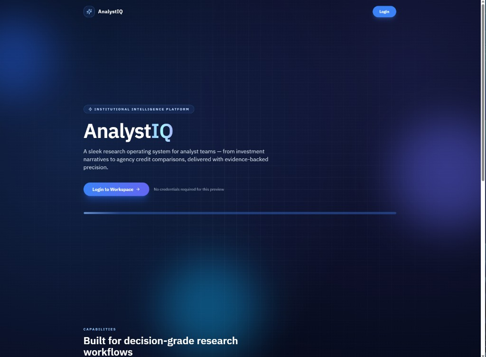
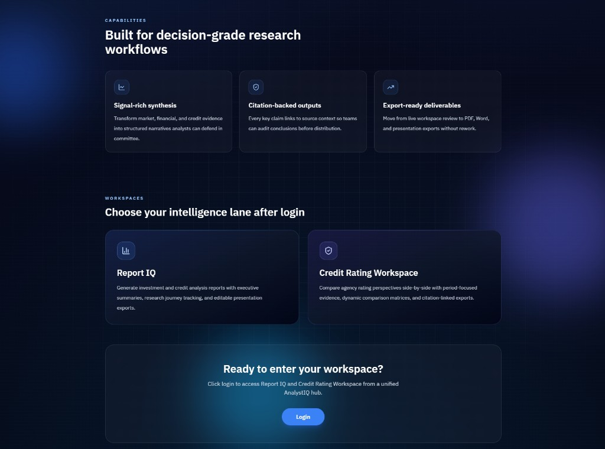

# AnalystIQ (Intelligent Financial Research Platform)

[](https://www.python.org/downloads/)
[](https://opensource.org/licenses/MIT)

**AnalystIQ** is an AI-powered institutional research platform. From a single entry point, analyst teams can generate investment and credit reports (**Report IQ**) or run agency credit rating comparisons (**Credit Rating Workspace**) — with live progress, citation-linked outputs, and export-ready deliverables.

## 🚀 Key Features

### Platform
- **AnalystIQ landing page** — professional login entry (preview mode: click Login, no credentials required)
- **Unified workspace hub** — switch between **Report IQ** and **Credit Rating Workspace**
- **FastAPI backend** with SSE job streaming, artifact delivery, and immersive report viewer
- **Redis caching** to reduce latency and API spend

### Report IQ (Institutional Report Generation)
- **One-click research** from ticker → full investment or credit analysis report
- **Multi-source data** via web search (Tavily) + financials (yfinance)
- **LLM orchestration** through OpenRouter (Gemini, GPT, Claude, etc.)
- **Publication-ready output** with charts, tables, and citations
- **Live progress** — status strip, research journey, report snapshot, activity timeline
- **Exports** — PDF, editable PowerPoint (.pptx), immersive HTML viewer

### Credit Rating Workspace
- **Agency comparison** — Moody's, Fitch, S&P, MSCI ESG (multi-select)
- **Rating period focus** — single year or year range to scope evidence and synthesis
- **Evidence-backed synthesis** — narrative brief (≤250 words) + comparison matrix
- **Dynamic matrix dimensions** — LLM chooses comparison rows from context; **Current Rating** is always first
- **Citation-linked UI** — hover/click citations in narrative and matrix (same pattern as Report IQ)
- **Exports** — Word (.doc) and PDF artifacts

### Legacy & CLI
- **Streamlit UI** (legacy) and **CLI** for batch runs

## 📊 Report IQ — Report Structure

Each generated report follows a professional investment analysis structure:

1. **Executive Summary** — Key findings and investment outlook
2. **Company Overview** — Business model and core operations
3. **Industry & Competitive Analysis** — Market positioning and competitive moat
4. **Financial Performance** — Deep dive into financial statements and KPIs
5. **Growth Catalysts** — Future opportunities and growth drivers
6. **Valuation Assessment** — Current valuation vs peers and intrinsic value
7. **Risk Analysis** — Potential risks and mitigation strategies
8. **Investment Conclusion** — Final recommendation and outlook

## 🏗️ Architecture

```
┌──────────────────────────┐     ┌──────────────────┐     ┌─────────────────┐
│  AnalystIQ Web UI        │────▶│  FastAPI (API)   │────▶│  AgentInvest    │
│  Landing → Workspace Hub │     │  web_api.py      │     │  Core (agent.py)│
│  Report IQ + Credit WS   │     │                  │     │                 │
└──────────────────────────┘     └──────────────────┘     └─────────────────┘
                                           │                         │
                                    ┌──────▼──────┐         ┌────────┼────────┐
                                    │ SSE / Jobs  │         │        │        │
                                    │ + Artifacts │    Web Search  Financial  LLM
                                    └─────────────┘    (Tavily)     (YF)   (OpenRouter)
```

## 🛠️ Tech Stack

### Core Technologies
- **Python 3.10+** — Backend and agent orchestration
- **FastAPI** — REST API, job lifecycle, SSE progress, artifact delivery
- **OpenRouter** — Unified API for multiple LLM models
- **LlamaIndex** — AI agent framework and tools

### Frontend (AnalystIQ Web UI)
- **Vite 5** — Dev server and production bundler
- **React 18** + **TypeScript** — Component-based UI
- **Tailwind CSS 3** — Utility-first styling
- **shadcn/ui-style primitives** — Radix UI components
- **Lucide React** — Icons

### Legacy UI
- **Streamlit** — Original interactive interface (`streamlit_app.py`)

### Data Sources
- **Yahoo Finance (yfinance)** — Financial data and market information
- **Tavily API** — Web search and content extraction
- **Trafilatura** — Web content extraction and cleaning

### Report Generation
- **Markdown2** — Markdown to HTML conversion
- **Playwright** — PDF generation and chart rendering
- **Chart.js** — Interactive chart generation

### Infrastructure
- **Redis** — Caching layer (reports + credit rating workspace steps)

## 📋 Prerequisites

### Required API Keys
- **OpenRouter** — LLM access ([openrouter.ai](https://openrouter.ai))
- **Tavily API** — Web search

### System Requirements
- Python 3.10+
- **Node.js 18+** and **npm** (frontend development)
- 4GB+ RAM recommended
- Playwright Chromium (`python -m playwright install chromium`)

## 🚀 Quick Start

1. **Clone the repository**
   ```bash
   git clone https://github.com/Michael-HK/PoC_AgentInvest.git
   cd PoC_AgentInvest
   ```

2. **Create virtual environment**
   ```bash
   python -m venv venv
   # Windows:
   venv\Scripts\activate
   # macOS/Linux:
   source venv/bin/activate
   ```

3. **Configure API credentials**
   ```bash
   # Windows PowerShell
   $env:TAVILY_API_KEY="YOUR_TAVILY_API_KEY"
   $env:OPENROUTER_API_KEY="YOUR_OPENROUTER_API_KEY"

   # macOS/Linux
   export TAVILY_API_KEY="YOUR_TAVILY_API_KEY"
   export OPENROUTER_API_KEY="YOUR_OPENROUTER_API_KEY"
   ```

4. **Install dependencies**
   ```bash
   pip install -r requirements.txt
   python -m playwright install chromium
   ```

5. **Run the app (development)**

   **Terminal 1 — API**
   ```bash
   uvicorn web_api:app --reload --port 8000
   ```

   **Terminal 2 — Frontend**
   ```bash
   cd frontend
   npm install
   npm run dev
   ```

   Open **http://localhost:5173** → **Login** → choose **Report IQ** or **Credit Rating Workspace**.

6. **Production-style (single process)**
   ```bash
   cd frontend
   npm ci
   $env:VITE_ANALYSTIQ_API_BASE="/api"   # Windows PowerShell
   npm run build
   cd ..
   uvicorn web_api:app --host 0.0.0.0 --port 8000
   ```
   Open **http://localhost:8000**.

## ⚙️ Configuration Quick Reference

| Task | Command |
|------|---------|
| **Start API** | `uvicorn web_api:app --reload --port 8000` |
| **Start frontend (dev)** | `cd frontend && npm run dev` |
| **Build frontend** | `cd frontend && npm run build` |
| **Generate report (CLI)** | `python -m main AAPL` |

| Variable | Default (dev) | Description |
|----------|---------------|-------------|
| `VITE_ANALYSTIQ_API_BASE` | `/api` (Vite proxy) | API base path |
| `REDIS_URL` / `REDIS_HOST` | optional | Enables report and credit-rating caching |

## 🌐 Using the Web UI

### 1. AnalystIQ Landing Page
- Open the app and click **Login** (no credentials in preview mode)
- Scroll through capabilities and workspace previews

### 2. Report IQ
1. Select ticker, report type (investment / credit), presentation style, optional instructions
2. Click **Generate Report** — follow status strip and activity timeline
3. Review **Report Snapshot** (brief + decision highlights)
4. Download **PDF** or generate **PPTX**; open **Immersive Report Viewer**

### 3. Credit Rating Workspace
1. Select ticker, **rating period** (from/to year), and agencies
2. Click **Generate Comparison**
3. Review narrative brief and dynamic comparison matrix (Current Rating first)
4. Export **Word** or **PDF**

## 🖼️ Frontend Screenshots

### AnalystIQ Landing Page — Hero
Institutional intelligence platform entry with animated beam and login CTA.



### AnalystIQ Landing Page — Capabilities & Workspaces
Scroll sections previewing Report IQ and Credit Rating Workspace.



### Report IQ — Workspace Overview
Configuration sidebar, executive deliverables, research outline, and live activity timeline.


### Report Snapshot
Report Brief with linked citations and Decision Highlights as synthesis completes.


### Immersive Report Viewer
Full rendered report with expandable sections, citations, and references.


### Report Viewer — Charts and Analysis
Embedded Chart.js visualizations and section-level analysis.


## 💻 Frontend Development

### Project layout

```
frontend/
├── src/
│   ├── App.tsx                         # Landing gate + workspace hub
│   ├── features/
│   │   ├── landing/                    # AnalystIQ landing page
│   │   ├── report-config/              # Report IQ configuration
│   │   ├── report-runner/              # Status, timeline, research, snapshot
│   │   ├── credit-rating/              # Credit Rating Workspace
│   │   ├── artifacts/                  # PDF / PPTX downloads
│   │   └── report-viewer/              # Immersive viewer dialog
│   ├── components/ui/                  # shadcn-style primitives
│   └── lib/api.ts                      # API client
└── package.json
```

### npm scripts

| Script | Description |
|--------|-------------|
| `npm run dev` | Vite dev server on port **5173** |
| `npm run build` | Typecheck + production build |
| `npm run preview` | Preview production build |
| `npm run lint` | ESLint |

## 📁 Project Structure

```
PoC_AgentInvest/
├── agent.py                 # Core agent (reports + credit rating workspace)
├── web_api.py               # FastAPI (jobs, SSE, artifacts, static UI)
├── prompts.py               # AI prompts and templates
├── cache_manager.py         # Redis caching (reports + credit rating)
├── frontend/                # AnalystIQ Web UI
├── docs/images/             # README screenshots
├── tools/                   # Web search + financial data
└── generated_reports/       # Output artifacts
```

## 🔍 Key API Endpoints

| Area | Endpoints |
|------|-----------|
| **Reports** | `POST /api/reports/jobs`, `GET /api/reports/jobs/{id}/events` (SSE) |
| **Credit Rating** | `POST /api/credit-rating/jobs`, `GET /api/credit-rating/options` |
| **Artifacts** | PDF/PPTX (reports), DOC/PDF (credit rating workspace) |

## 📄 License

MIT — see [LICENSE](LICENSE).

## 🙏 Acknowledgments

- **OpenRouter**, **Tavily**, **Yahoo Finance**, **LlamaIndex**, **Playwright**, **Streamlit**

---

**Disclaimer**: Proof of Concept for demonstration only. Generated outputs are not financial advice. Consult qualified professionals before investment decisions.
