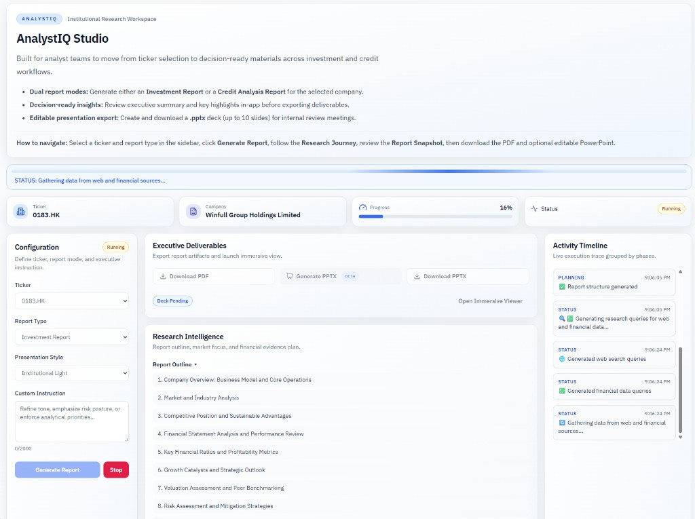
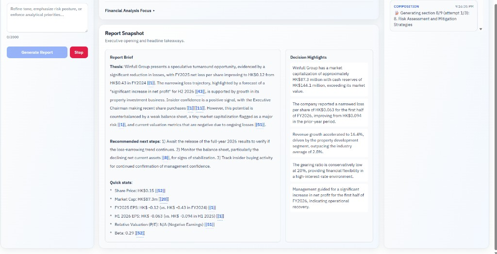
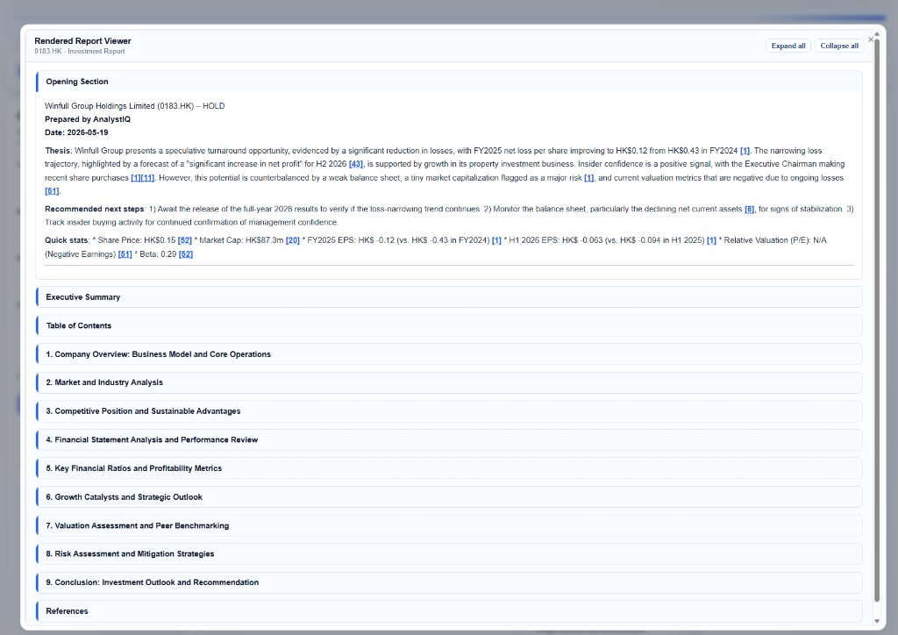
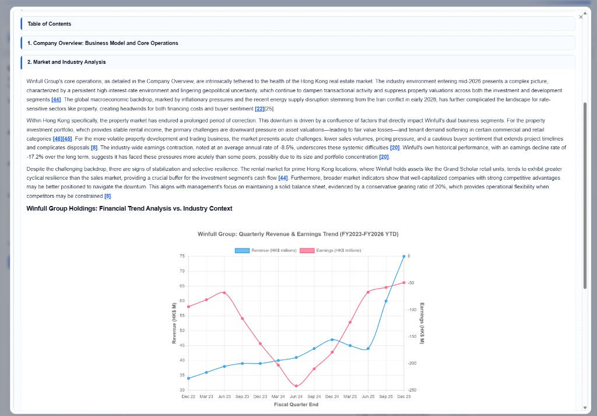

# InvestIQ (Intelligent investment report generation)

[](https://www.python.org/downloads/)
[](https://opensource.org/licenses/MIT)

**InvestIQ** is an AI-powered platform that generates professional investment theses, PDF reports and PowerPoint presentations from a single input: a stock ticker.

## 🚀 Key Features

- **One-click research** from ticker → full investment report
- **Multi-source data** via web search (Tavily) + financials (yfinance)
- **LLM orchestration** through OpenRouter (Gemini, GPT, Claude, etc.)
- **Publication-ready output** with charts, tables, and citations
- **AnalystIQ Studio** — React web UI with live progress, research panels, and artifact downloads
- **FastAPI backend** with SSE job streaming and immersive report viewer
- **Streamlit UI** (legacy) and **CLI** for batch runs
- **Caching** with Redis to cut latency and API spend

## 📊 Report Structure

Each generated report follows a professional investment analysis structure:

1. **Executive Summary** - Key findings and investment outlook
2. **Company Overview** - Business model and core operations
3. **Industry & Competitive Analysis** - Market positioning and competitive moat
4. **Financial Performance** - Deep dive into financial statements and KPIs
5. **Growth Catalysts** - Future opportunities and growth drivers
6. **Valuation Assessment** - Current valuation vs peers and intrinsic value
7. **Risk Analysis** - Potential risks and mitigation strategies
8. **Investment Conclusion** - Final recommendation and outlook

## 🏗️ Architecture

```
┌──────────────────────────┐     ┌──────────────────┐     ┌─────────────────┐
│  AnalystIQ Studio (UI)   │────▶│  FastAPI (API)   │────▶│  AgentInvest    │
│  Vite + React + Tailwind │     │  web_api.py      │     │  Core (agent.py)│
└──────────────────────────┘     └──────────────────┘     └─────────────────┘
                                           │                         │
                                           │              ┌──────────┼──────────┐
                                           │              │          │          │
                                    ┌──────▼──────┐ ┌─────▼─────┐ ┌──▼────────┐
                                    │ SSE / Jobs  │ │ Web Search│ │ Financial │
                                    │ + Artifacts │ │  (Tavily) │ │ Data (YF) │
                                    └─────────────┘ └───────────┘ └───────────┘
```

## 🛠️ Tech Stack

### Core Technologies
- **Python 3.10+** - Backend and agent orchestration
- **FastAPI** - REST API, job lifecycle, SSE progress, artifact delivery
- **OpenRouter** - Unified API for accessing multiple LLM models (Gemini, GPT, Claude, etc.)
- **LlamaIndex** - AI agent framework and tools

### Frontend (AnalystIQ Studio)
- **Vite 5** - Dev server and production bundler
- **React 18** + **TypeScript** - Component-based UI
- **Tailwind CSS 3** - Utility-first styling and design tokens
- **shadcn/ui-style primitives** - Radix UI + `class-variance-authority` (Card, Dialog, Button, etc.)
- **Lucide React** - Icons

### Legacy UI
- **Streamlit** - Original interactive interface (`streamlit_app.py`)

### Data Sources
- **Yahoo Finance (yfinance)** - Financial data and market information
- **Tavily API** - Web search and content extraction
- **Trafilatura** - Web content extraction and cleaning

### Report Generation
- **Markdown2** - Markdown to HTML conversion
- **Playwright** - Modern browser automation for PDF generation and chart rendering
- **Chart.js** - Interactive chart generation

### Infrastructure
- **Redis** - Caching layer for performance optimization

## 🎯 OpenRouter

AgentInvest uses **OpenRouter** as the LLM provider, offering several advantages:

### 🔄 **Model Flexibility**
- **Multi-Provider Access**: Single API for Gemini, GPT, Claude, Llama, and 100+ other models
- **Easy Model Switching**: Change models without code modifications
- **Cost Optimization**: Compare pricing across different providers
- **Performance Testing**: Benchmark different models for your use case

## 📋 Prerequisites

### Required API Keys
- **OpenRouter** - For accessing various LLM models (supports Gemini, GPT, Claude, and more)
- **Tavily API** - For web search capabilities

### System Requirements
- Python 3.10+ or higher
- **Node.js 18+** and **npm** (for local frontend development)
- 4GB+ RAM recommended
- Internet connection for API access
- Playwright Chromium browser (automatically installed)

## 🚀 Quick Start

1. **Clone the repository**
   ```bash
   git clone <repository-url>
   cd PoC_AgentInvest
   ```

2. **Create Virtual Environment (Recommended)**
   ```bash
   # Create virtual environment
   python -m venv venv
   
   # Activate virtual environment
   # Linux/macOS:
   source venv/bin/activate
   # Windows:
   venv\Scripts\activate
   ```

3. **Configure API credentials**
   - Obtain an OpenRouter API key from [openrouter.ai](https://openrouter.ai)
   - Set environment variables (no keys shown):

```bash
# macOS/Linux (bash/zsh)
export TAVILY_API_KEY="YOUR_TAVILY_API_KEY"
export OPENROUTER_API_KEY="YOUR_OPENROUTER_API_KEY"

# Windows PowerShell
$env:TAVILY_API_KEY="YOUR_TAVILY_API_KEY"
$env:OPENROUTER_API_KEY="YOUR_OPENROUTER_API_KEY"
```

4. **Install Python dependencies**
   ```bash
   pip install -r requirements.txt
   ```

5. **Install Playwright browsers**
   ```bash
   python -m playwright install chromium
   ```

6. **Run AnalystIQ Studio (recommended)**

   Use two terminals — API first, then the frontend.

   **Terminal 1 — API**
   ```bash
   uvicorn web_api:app --reload --port 8000
   ```

   **Terminal 2 — Frontend**
   ```bash
   cd frontend
   npm install
   npm run dev
   ```

   Open **http://localhost:5173**. The Vite dev server proxies `/api` to `http://127.0.0.1:8000`.

   **Production-style (single process)** — build the UI and serve it from FastAPI:
   ```bash
   cd frontend
   npm ci
   $env:VITE_ANALYSTIQ_API_BASE="/api"   # Windows PowerShell
   # export VITE_ANALYSTIQ_API_BASE=/api   # macOS/Linux
   npm run build
   cd ..
   uvicorn web_api:app --host 0.0.0.0 --port 8000
   ```
   Then open **http://localhost:8000**.

7. **Legacy Streamlit app (optional)**
   ```bash
   python -m streamlit run streamlit_app.py
   ```
   Open **http://localhost:8501**.

8. **CLI**
   - Open terminal and type in

 ```bash
# US example (Apple)
python -m main AAPL

# Hong Kong example (HSBC Holdings)
python main.py 0005.HK
```
## ⚙️ Configuration

### Quick Reference Commands

| Task | Command |
|------|---------|
| **Start API** | `uvicorn web_api:app --reload --port 8000` |
| **Start frontend (dev)** | `cd frontend && npm run dev` |
| **Build frontend** | `cd frontend && npm run build` |
| **Start Streamlit (legacy)** | `python -m streamlit run streamlit_app.py` |
| **Generate Report (CLI)** | `python -m main AAPL` |

## Supported Stock Tickers

The application supports:
- **US Stocks**: AAPL, MSFT, GOOGL, AMZN, NVDA, TSLA, etc.
- **Hong Kong Stocks**: 0001.HK, 0002.HK, etc. (200+ tickers)

### Web Interface (AnalystIQ Studio)
1. Open the app at `http://localhost:5173` (dev) or your deployed URL
2. Configure **Ticker**, **Report Type**, **Presentation Style**, and optional custom instructions
3. Click **Generate Report** and follow the status strip and activity timeline
4. Review **Report Snapshot** (brief + decision highlights) as sections complete
5. Download **PDF** or generate/download **PPTX** from Executive Deliverables
6. Open the **Immersive Report Viewer** for the full rendered report with citations and charts

## 🖼️ Frontend Screenshots

### AnalystIQ Studio — Workspace Overview
Configuration sidebar, executive deliverables, research outline, and live activity timeline during report generation.



### Report Snapshot
Report Brief with linked citations and Decision Highlights as synthesis completes.



### Immersive Report Viewer
Full rendered report with expandable sections, citations, and references.



### Report Viewer — Charts and Analysis
Embedded Chart.js visualizations and section-level analysis in the immersive viewer.



## 💻 Frontend Development

### Project layout

```
frontend/
├── src/
│   ├── App.tsx                    # Main workspace shell
│   ├── features/
│   │   ├── report-config/         # Ticker, report type, instructions
│   │   ├── report-runner/         # Status, timeline, research, snapshot
│   │   ├── artifacts/             # PDF / PPTX downloads
│   │   └── report-viewer/         # Immersive viewer dialog
│   ├── components/ui/             # shadcn-style primitives
│   └── lib/api.ts                 # API client (/api proxy in dev)
├── vite.config.ts                 # Dev server + /api → :8000 proxy
└── package.json
```

### npm scripts

| Script | Description |
|--------|-------------|
| `npm run dev` | Start Vite on port **5173** with hot reload |
| `npm run build` | Typecheck and build to `frontend/dist` |
| `npm run preview` | Preview production build locally |
| `npm run lint` | Run ESLint |

### Environment

| Variable | Default (dev) | Description |
|----------|---------------|-------------|
| `VITE_ANALYSTIQ_API_BASE` | `/api` (via Vite proxy) | API base path for fetch/SSE |

Set `VITE_ANALYSTIQ_API_BASE=/api` when building for production (see `render.yaml`).

### Deployed app

Production is a **single service**: FastAPI serves the API and the built React app from `frontend/dist` on the same origin (e.g. `https://invest-report-workflow.onrender.com`).

## 📁 Project Structure

```
PoC_AgentInvest/
├── agent.py                 # Core AgentInvest class
├── web_api.py               # FastAPI app (jobs, SSE, artifacts, static UI)
├── streamlit_app.py         # Legacy Streamlit interface
├── main.py                  # CLI entry point
├── report_viewer.py         # Immersive HTML report viewer
├── ppt_export.py            # PPTX generation
├── prompts.py               # AI prompts and templates
├── utils.py                 # Playwright-based PDF generation utilities
├── cache_manager.py         # Redis caching layer
├── plot_utils.py            # Chart generation utilities
├── tickers.py               # Supported stock tickers
├── requirements.txt         # Python dependencies
├── render.yaml              # Render.com deployment blueprint
├── frontend/                # AnalystIQ Studio (Vite + React + TypeScript)
│   ├── src/
│   └── package.json
├── tools/
│   ├── web_search.py        # Tavily web search
│   ├── financial_tools.py   # Yahoo Finance integration
│   └── __init__.py
├── docs/
│   └── images/              # README screenshots
└── generated_reports/       # Output directory for reports
```

## 🔍 Key Components

### AgentInvest Core (`agent.py`)
The main orchestrator that coordinates data gathering, AI analysis, and report generation.

### Web Search Tool (`tools/web_search.py`)
Handles web search queries using Tavily API for current market information and news.

### Financial Tools (`tools/financial_tools.py`)
Integrates with Yahoo Finance for historical data, financial statements, and company information.

### Report Generation (`utils.py`)
Converts Markdown reports with embedded charts into professional PDF documents using Playwright.

### Caching System (`cache_manager.py`)
Redis-based caching to improve performance and reduce API costs.

### Web API (`web_api.py`)
FastAPI application: report job queue, SSE progress stream, PDF/PPTX artifacts, health check, and serving the production React build.

### Frontend (`frontend/`)
AnalystIQ Studio — institutional research workspace with configuration panel, live timeline, report snapshot, and immersive viewer.

## 📄 License

This project is licensed under the MIT License - see the [LICENSE](LICENSE) file for details.

## 🙏 Acknowledgments

- **OpenRouter** for providing unified access to multiple LLM models
- **Tavily** for web search API services
- **Yahoo Finance** for financial data access
- **Streamlit** for the web application framework
- **LlamaIndex** for AI agent orchestration
- **Playwright** for modern browser automation and PDF generation

---

**Disclaimer**: This is a Proof of Concept for demonstration purposes. The generated reports are for informational use only and should not be considered as financial advice. Always consult with qualified financial professionals before making investment decisions.
